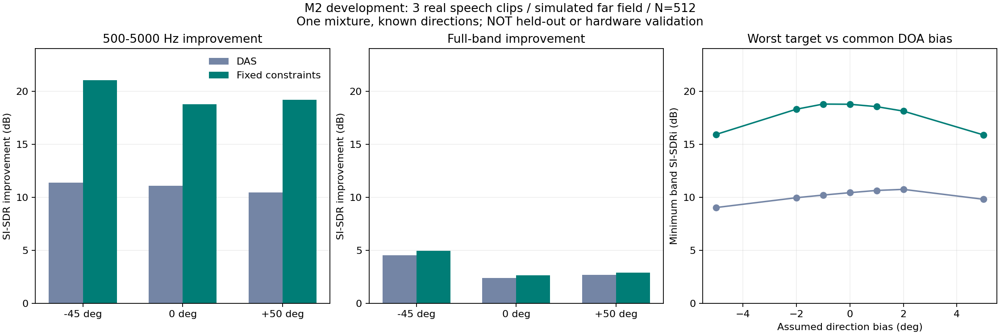

# M2 真实语音与固定约束波束开发报告

> 文档类别：实验与验证｜状态：历史阶段记录；不代表当前项目状态。[返回文档索引](../文档索引.md)。

日期：2026-09-20；版本：v0.3.0。**已实现真实语音接入、固定约束波束和方向偏差扫描；M2正式B1验收未完成。**

## 结果与意义

三位朗读者、每人10秒、已知方向−45°/0°/+50°，以独立时域传播模拟16麦远场。对比DAS和固定约束波束，采用相同输入、流式STFT重建和评价方式。没有添加房间混响或通道误差，不代表真实阵列实测。



512点、方向无误差时：

| 目标 | DAS带内SI-SDRi | 固定约束带内SI-SDRi | DAS全带SI-SDRi | 固定约束全带SI-SDRi |
|---|---|---|---|---|
| −45° | 11.372 dB | 21.047 dB | 4.522 dB | 4.963 dB |
| 0° | 11.066 dB | 18.764 dB | 2.397 dB | 2.620 dB |
| +50° | 10.431 dB | 19.174 dB | 2.703 dB | 2.895 dB |

256点固定约束的三个带内改善分别为19.278、19.763、17.254 dB。512点并非对每位说话人都更好，当前不冻结窗长。

全部假定方向共同偏移±5°时，512点固定约束三个目标中的最低带内改善仍约15.87 dB。这只说明本例对共同方向偏差有一定容忍，不代表独立DOA误差、近角声源或动态跟踪已经通过。

**全带改善明显小于带内改善，必须保留这个差距。** 对这三段预处理语音做全段FFT功率分解，500Hz以下能量约占86.02%、64.46%、47.99%。该频段仍使用DAS，加上较宽的低频波束，是后续改进应重点检查的因素；这些百分比不是语音可懂度贡献比例，也不能单凭它们证明所有全带损失成因。当前没有通过删除低频来制造全带成绩。

## 算法与保护

- 带内求解CᴴW=I的SVD最小范数解，属于单位协方差的固定几何约束，不是自适应协方差LCMV。
- 每频点保留条件数、实际约束残差、WNG和状态；秩不足、条件数超限或噪声增益过差时回退DAS。
- 本例14套权重（2种FFT×7种偏差）未触发保护，最大约束残差约6.79e−15，最低WNG约7.55dB。这些是对假定方向的数值性质，不能等同为实际音频零串扰。
- 频带外保持DAS；DC/Nyquist保持实数。所有方法共享同一个StreamingBeamformer，避免不同重建流程带来不公平比较。
- 总共84条逐目标评价记录，不是84个独立混合场景。它们来自同一组语音和几何场景。

## 数据、处理与许可

采用librosa托管的LibriSpeech示例5703-47212-0000、3436-172162-0000、198-209-0000；原文件均为22050Hz OGG，SHA-256与官方registry相同，三份总大小241,012 bytes。源数据来自16kHz LibriSpeech，重采样到48kHz不会产生原录音没有的高频信息。

从整个片段重采样后取前10秒、去直流、将整段RMS调至0.04；各麦独立噪声RMS=0.002。整段RMS不是S1协议要求的活动段RMS，因此本轮开发测试明确不代替正式S1。

归属：Garth Comira（The Ashiel Mystery）、Anders Lankford（The Age of Chivalry）、Heather Barnett（Sense and Sensibility）；LibriSpeech/LibriVox，样例由librosa托管。[原始数据许可说明](https://www.openslr.org/12/)为[CC BY 4.0](https://creativecommons.org/licenses/by/4.0/)。

本项目进行了重采样、裁剪、音量调整、模拟空间混合和波束处理。分享派生音频时须保留上述归属、许可链接和修改说明。完整原始文件URL与哈希见[data manifest](../../data/manifests/libri_examples.json)。

## 试听与复现

以下均为同一共享增益0.5的PCM16试听文件，指标使用量化前浮点数据：

- [原始混合](../../artifacts/runs/speech_20260919T155643_653358Z_936bac15/mixture_reference.wav)
- [−45°目标：固定约束输出](../../artifacts/runs/speech_20260919T155643_653358Z_936bac15/fixed_constraint_512_target_0.wav)
- [0°目标：固定约束输出](../../artifacts/runs/speech_20260919T155643_653358Z_936bac15/fixed_constraint_512_target_1.wav)
- [+50°目标：固定约束输出](../../artifacts/runs/speech_20260919T155643_653358Z_936bac15/fixed_constraint_512_target_2.wav)

其他DAS、参考源和256点输出见同一run目录。[完整指标](../../artifacts/runs/speech_20260919T155643_653358Z_936bac15/metrics.json)、[运行manifest](../../artifacts/runs/speech_20260919T155643_653358Z_936bac15/manifest.json)。

```powershell
.venv/Scripts/python.exe tools/download_speech_examples.py
.venv/Scripts/python.exe -m acoustic_array.pipelines.speech_experiment --config configs/experiments/m2_speech_development.json
```

命令工作目录为项目根目录。每次创建新run，保留输入分量、配置、源数据/源码/输出哈希、14套权重和诊断。图表来自相同metrics.json，由Matplotlib3.10.8绘制，仅作报告附件，不是运行核心依赖。

## 验证和审查

- 98项pytest通过，覆盖M1回归与新增约束、重复方向、WNG保护、无有效频点、语音哈希、重采样、相近偏差文件不覆盖。
- Ruff检查、格式检查、pip check、editable安装和wheel构建通过。
- 重复运行四组无偏差浮点输出（两方法×两FFT）逐元素相同；最终run的源码/输出哈希核验一致。
- 独立审查发现两项P2并已关闭：空频带导致NaN归档失败、偏差显示精度不足导致文件覆盖。修复均有回归；审查代理复核相关9项测试通过。
- 证据：[测试XML](../../artifacts/validation/m2-tests.xml)、[数值与溯源核验](../../artifacts/validation/m2-numerical-checks.json)。

## 尚未完成及下一步

1. 仅三位开发说话人和一组混合，不足以满足30个独立场景的B1要求；这些片段不得进入独立保留集。
2. 本轮是整段指标，尚未实现正式参考活动掩码、场景分组/置信区间；无SIR分量评价或实录校准。
3. 需要扩大语料、加入独立方向误差、增益/延迟误差与混响，对失败场景做回归。
4. 检查500Hz以下处理策略对全带效果的影响；任何扩频方案先验证WNG、目标失真和量化代价，再通过ADR变更。
5. 自动DOA、动态跟踪、定点参考和FPGA实测仍在后续阶段。当前不会把一个理想开发样例报告为多声源分离系统完成。
