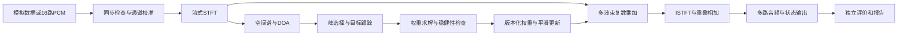

# 架构设计

> 文档类别：架构与规范｜状态：现行维护文档。[返回文档索引](../文档索引.md)。

版本：0.3；状态：M1基础链路及M2固定约束求解、通用流式波束、真实语音适配和开发实验已实现；校准、自动定位/跟踪、动态权重和定点仍为设计基线。目标是同一组数据契约下，替换算法、复用评价，并逐步迁移到实时定点实现。

## 三种运行模式

1. **研究参考模式**：float64/complex128，允许 oracle 方向和离线算法，结果明确标记；用于上限和正确性对照。
2. **可部署浮点模式**：只读取当前及历史输入，显式状态、固定块协议，提供资源预算；用于验证真正可流式的处理链。
3. **定点对照模式**：与目标硬件一致的整数运算、量化、缩放及帧序；用于误差定位和 golden vectors。

三种模式共享坐标、频率、通道、权重含义，不强迫共用数值内核。外部仿真库通过适配器接入，不把其数组约定暴露给全部模块。

## 数据流

PDM→CIC→补偿 FIR 属于前端与 FPGA 交接任务，软件初期从 PCM 开始；模拟前端另行接入。评价可读取真实标签，在线处理模块不得访问真实标签。

## 模块与依赖

| 模块 | 职责 | 不应承担 |
|---|---|---|
| core | 几何、单位、公共数据结构和配置校验 | 读 WAV、GUI、设备控制 |
| simulation | 传播、混合、RIR 适配、误差注入 | 在线算法内部真值回填 |
| dsp | 分帧、FFT、窗、重建、通用滤波 | 业务场景和图形展示 |
| calibration | 校准估计与应用、残差报告 | 默认把传播时延当器件误差 |
| localization | 扫描空间谱、DAS/SRP-PHAT 候选 | 稳定 ID 分配 |
| tracking | 活动判定、关联、出生/消失、滞回 | FFT 和音频文件读写 |
| beamforming | steering、DAS、约束求解、权重稳定性 | 在内部隐式更改阵列坐标 |
| numeric | 定点原语、数值范围、量化参考 | 冒充特定 IP 的未知运算实现 |
| evaluation | 独立指标、统计、分组报告 | 向在线算法提供干净源 |
| io | WAV、manifest、外部库与板端格式适配 | 核心算法选择 |
| pipelines | 配置组装、执行、运行元数据 | 巨型数值实现 |

core 位于底层；数值模块依赖 core/dsp，不依赖 pipelines。pipelines 组装实现。只有 pipelines/入口触发 IO；评价运行在处理完成或旁路，不反向影响输出。扩展算法优先使用统一函数签名和返回结构，出现两个实际实现后再提取必要接口。

## 约束波束形成路线

每频点令 C=[a_target,a_interferer1,...]，约束 Cᴴw=g，输出 y=wᴴx。固定方向基线可在 R=I 条件下求最小范数解；LCMV 候选使用经过正则化的协方差 R。

实现求解线性方程，不显式求逆；每次记录条件数/秩、约束残差、权重范数和白噪声增益。约束不可满足或过度放大噪声时按配置降级为软约束/DAS并报告状态；不能无声地产生爆音。

DOA 更新不等于每帧独立重置声源身份；权重更新绑定 source_id 和生效帧。权重平滑可能暂时改变约束响应，必须连同音质、方向响应、延迟一起评价，不能只检查是否消除切换脉冲。

## FPGA 映射与边界

初始候选：PL 做同步采集、前端、校准应用、FFT、空间谱的大量乘加、目标波束乘加、IFFT/OLA；PS 做峰检测/跟踪和权重求解。最终分配以测得的吞吐/资源为准。

FFT 共享、复乘时分复用、steering 存储/现场生成、空间谱更新降频分别做预算。算法易并行不代表适合全部空间并行实例化；禁止将每方向每频点每麦的全部乘法器直接展开作为默认方案。

## 可扩展性边界

- 通道数 M、输出数 K、几何和频带由配置驱动；第一套验收使用 M=16、K≤3。
- 远场方向模型和近场点声源模型显式区分；新增模型不改变原数据轴含义。
- 新 DOA/波束形成/后滤波实现必须能进入同一实验框架；不绕开基线和失败统计。
- 未来 C/C++/PS 部署通过相同契约对照 Python，不把语言迁移和算法改进混为一次无法归因的变化。
- 初期不建 GUI、服务端或远程训练平台，不为未证实需求增加系统层数。

## 第一次实现必须解决

库自带居中补零与因果流式语义差异；Hann 分析/合成窗配对；尾帧 flush；有限窗对宽带延迟的影响；共轭对称和 Nyquist；频带外输出；无效权重的可靠回退。STFT 选择要有重建和算法效果证据，不能仅按窗长推导完整端到端延迟。

## 近场扩展

core/geometry按可选距离生成MIC参考归一化流形；simulation/near_field独立标量计算直达声，不调用流形。beamforming复用同一DAS/最小范数求解，active_scene复用定标，pipelines/near_field_experiment只负责编排、评价与归档。无新增第三方依赖。

## 房间仿真扩展

simulation/room只负责第三方RIR适配与独立分量卷积；simulation/active_scene统一处理活动定标；evaluation/decay独立测衰减；pipelines/room_experiment编排双参考评价与证据归档。可选rir-generator留在离线侧，权重/流式层不依赖它或RIR。

## 混合协方差参考

beamforming/mpdr将校准协方差统计与权重求解分开，后续可复用求解器接持续更新；pipelines/mpdr_experiment仅负责父run复核、重建、时间隔离与评分。冻结权重仍共用StreamingBeamformer，不建立第二套STFT/ISTFT。当前统计辅助函数依赖dsp，核心配置/几何不反向依赖它。
